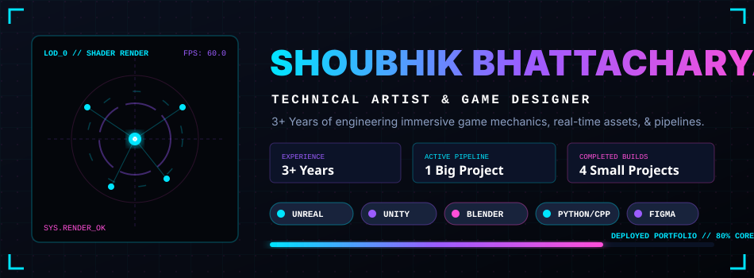
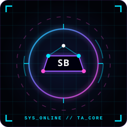

<div align="center">



<br/>


</div>

<br/>

## ✦ CHARACTER SELECT

<table>
<tr>
<td width="240" align="center" valign="top">

<br/>
<sub><b>LVL 8</b> · Game Artist / Technical Artist</sub>
<br/><br/>

</td>
<td valign="top">

```
> whoami

NAME       : Shoubhik Bhattacharya
CLASS      : Game Artist / Technical Artist
SPECIALTY  : Real-Time Rendering · Shaders · VFX · Playable Worlds
FOCUS      : Immersive AR / VR experiences
STATUS     : Actively building, always learning
LOCATION   : [REDACTED — set your city here]
```

<a href="#"></a>
<a href="#"></a>
<a href="#-the-lore"></a>
<a href="mailto:youremail@example.com"></a>

</td>
</tr>
</table>

<br/>

## ✦ THE LORE

```js
/**
 * Somewhere between a render pipeline and a level greybox,
 * a technical artist was born — equally happy debugging a
 * broken shader at 2am or polishing a particle system until
 * it finally feels "juicy."
 *
 * Spends real-world hours bridging the gap between artists
 * and engineers: building tools, writing shaders, and making
 * sure the game looks as good as it runs.
 */

const currentQuest   = "Diving deeper into real-time AR/VR rendering pipelines";
const wieldsOnSide    = ["GPU", "Keyboard + Mouse", "the occasional VR headset"];
const guildChannel    = "#vfx-and-tech-art";
const sendAMessage    = "youremail@example.com";
```

<br/>

## ✦ INVENTORY — Skills & Tech Stack

<table>
<tr><td><b>ART KIT</b></td></tr>
<tr><td>

</td></tr>
<tr><td><b>TECH ARSENAL</b></td></tr>
<tr><td>

</td></tr>
<tr><td><b>GAMEDEV KIT</b></td></tr>
<tr><td>

</td></tr>
</table>



<br/>

## ✦ ARCADE CABINET — Playable Builds

<div align="center">

<a href="#"></a>

</div>

| Cartridge 🎮 | Type | Engine |
|---|---|---|
| [Shoubhik_Bhattacharya_Portfolio](#) | Clean Logic Showcase | Unity |
| [Car-Chasing-Sim](#) | Big Vehicle Project | Unreal Engine |
| [Car-Chasing-Sim-Tech-Artist-Reel](#) | Tech Art Breakdown Reel | Unreal Engine |
| [Shoubhik_Bhattacharya_VFX_Tool](#) | Custom VFX Tool | Unity |
| [Shoubhik_AGE_Adventure](#) | Game Jam Build | Unity |

<sub>Repo names/links above are placeholders mirroring your previous cabinet — swap `#` for the real repo URLs.</sub>

<br/>

## ✦ LIVE CONTRIBUTION RADAR

<div align="center">


<br/>


</div>

<br/>

## ✦ GAME OVER? NAH — NEW GAME +

<div align="center">


<br/>

<a href="mailto:youremail@example.com"></a>
<a href="#"></a>
<a href="#"></a>

<br/><br/>


</div>
